# 🚀 HackVerse 2026 | ClinsightAI

**Company Track:** Clinsight
**Team Name:** Neural Ninjas
**Team Members:** Abhiram M V, Siddhi Muni, Jayan Agarwal

---

## 1️⃣ Problem Statement

**Which company problem did you choose?**

ClinsightAI — AI-Powered Healthcare Review Intelligence System.

**Restated in our own words:**

Multi-location healthcare groups collect thousands of patient reviews, but this data sits unused because it is unstructured, noisy, and impossible to translate into operational action at scale. Hospital administrators cannot answer: *Which specific operational problems are hurting our ratings? Are those problems systemic or isolated? What should we fix first to maximize rating improvement?*

**Who is the end user?**

Hospital operations managers, COOs, and healthcare business owners who need to make data-driven decisions about where to invest in quality improvement.

**Why is this problem important?**

Patient reviews contain high-signal intelligence about wait times, staff behavior, billing disputes, facility quality, and communication breakdowns — but only if analyzed systematically. A 0.5-star rating improvement can directly impact patient acquisition, retention, and hospital reputation. Most healthcare organizations lack the tooling to extract structured, prioritized insights from free-text feedback.

---

## 2️⃣ Why We Chose This Problem

**Why we selected this sponsor:**

Clinsight's problem has a direct line from analysis to action — hospital managers can use the output tomorrow to make budget and staffing decisions. Unlike abstract ML benchmarks, this problem demands real business impact.

**What makes this problem interesting or impactful:**

The problem requires going beyond basic sentiment analysis. The real challenge is quantifying which operational themes drive ratings, detecting recurring systemic issues, and converting that into an actionable improvement roadmap — layered technical depth with tangible business outcomes.

**What technical challenges attracted us:**

The problem requires NLP (theme extraction), statistical modeling (impact quantification), classification (systemic detection), and LLM integration (roadmap generation) — not just a single model call. The hybrid approach of combining semantic embeddings with Ridge regression and variance-based analysis is exactly the kind of multi-signal system that produces defensible, explainable results. Healthcare decisions require transparent reasoning, which pushed us toward interpretable models.

---

## 3️⃣ Solution Overview

ClinsightAI is a 7-step modular pipeline that transforms raw hospital reviews into a structured intelligence report with prioritized improvement recommendations. It takes a hospital review CSV containing free-text feedback and star ratings (1–5) as input. The system runs embedding-based semantic theme matching, Ridge regression for impact quantification with bootstrap confidence intervals, variance-based systemic classification, and LLM-grounded roadmap generation. The output is a structured JSON report with ranked themes, severity scores, confidence intervals, 1-star vs 5-star segment analysis, and an AI-generated improvement roadmap — plus a 10-page interactive Streamlit dashboard. What makes it unique is the clear separation between deterministic data-driven analysis and LLM-generated recommendations — the analytical core is 100% reproducible and works fully without any LLM.

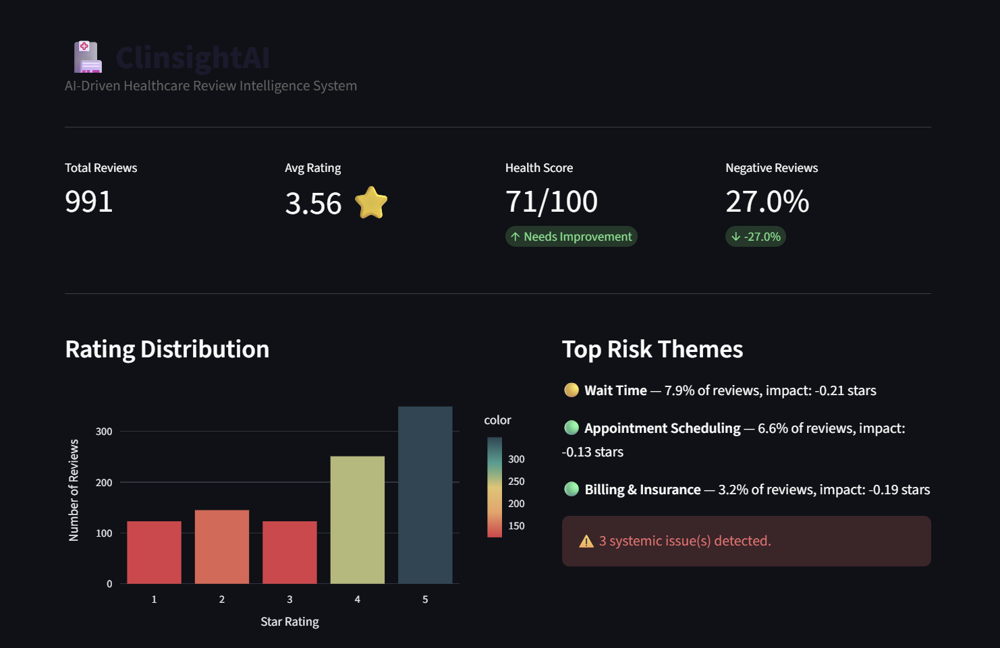

---

## 4️⃣ Architecture & System Design

### Architecture Diagram

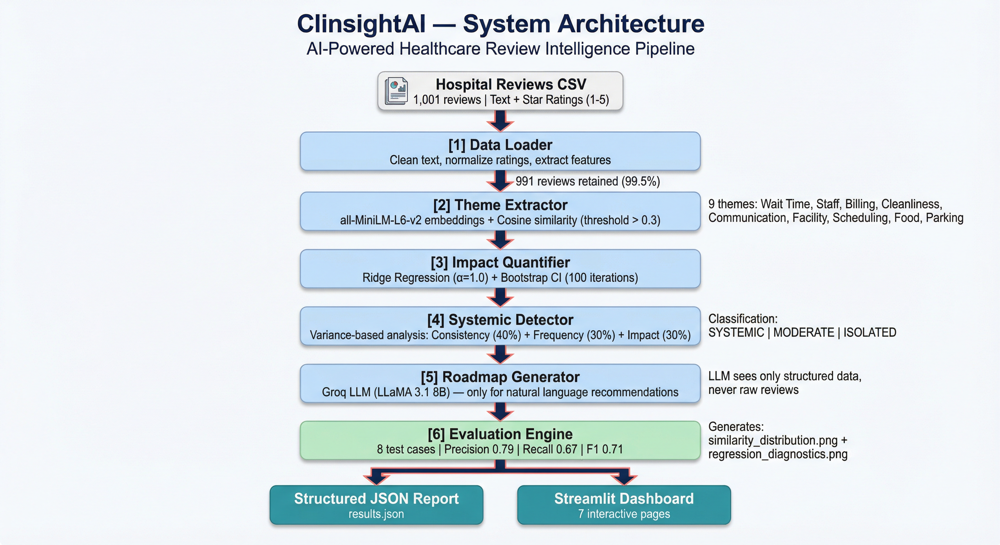

### Pipeline

```
Hospital Reviews CSV (1,001 reviews)
        ↓
   [1] Data Loader ──────────── Clean text, normalize ratings, extract features
        ↓                        Output: 991 reviews (99.5% retention)
   [2] Theme Extractor ──────── Sentence embeddings (all-MiniLM-L6-v2) + cosine similarity
        ↓                        9 operational themes matched semantically
   [3] Impact Quantifier ────── Ridge regression (α=1.0) + bootstrap CI (100 iterations)
        ↓                        Per-theme rating impact coefficients
   [4] Systemic Detector ────── Consistency (40%) + Frequency (30%) + Impact (30%)
        ↓                        Classification: SYSTEMIC / MODERATE / ISOLATED
   [5] Roadmap Generator ────── Groq LLM (LLaMA 3.1 8B) → prioritized recommendations
        ↓                        LLM sees only structured data, never raw reviews
   [6] Evaluation Engine ────── 8 test cases, precision/recall/F1, 2 visualization plots
        ↓
   [7] Structured Output ────── JSON report (results.json) + Streamlit Dashboard (10 pages)
```

### Data Flow

1. **Raw CSV** → `data_loader.py` cleans text (strip HTML/URLs, lowercase), normalizes ratings to 1–5, drops noise (<20 chars), extracts derived features (review_length, word_count)
2. **Cleaned DataFrame** → `theme_extractor.py` encodes all reviews + 9 theme descriptions into 384-dimensional embedding space, computes cosine similarity matrix (991 × 9), assigns themes at threshold > 0.3
3. **Theme-tagged DataFrame** → `impact_quantifier.py` fits Ridge regression (features = 9 binary theme columns, target = star rating), runs 100-round bootstrap for confidence intervals, normalizes severity scores 0–1
4. **Impact table** → `systemic_detector.py` computes coefficient of variation of similarity scores per theme, combines consistency + frequency + impact into weighted composite score, classifies issues
5. **Classified impact data** → `roadmap_generator.py` sends top 5 themes with quantitative context to Groq LLM, receives prioritized JSON recommendations
6. **Full pipeline output** → `evaluation.py` validates theme extraction against 8 hand-labeled test cases, generates similarity distribution and regression diagnostic plots
7. **Everything** → compiled into `results.json` and displayed via Streamlit dashboard

### Why This Architecture?

Each module is independent, testable, and has a single responsibility. The pipeline flows from raw data to business-ready output without circular dependencies. We can swap any component (e.g., replace Ridge with XGBoost, swap the embedding model, switch from Groq to OpenAI) without affecting the rest.

### Trade-offs Considered

| Decision | Choice | Alternative | Rationale |
|---|---|---|---|
| Theme detection | Sentence embeddings | Keyword lists, BERTopic/LDA | Embeddings generalize to unseen phrasings; keyword lists are fragile |
| Impact model | Ridge regression | Random Forest, XGBoost | Ridge gives interpretable coefficients; Random Forest gives importance but not direction |
| LLM usage | Roadmap only | LLM for theme extraction too | Keeps the analytical core deterministic and reproducible |
| Systemic detection | Variance-based composite | Simple frequency threshold | Captures whether a problem is uniformly experienced, not just how often it appears |
| Confidence | Bootstrap resampling | Single-point estimates | 100-iteration bootstrap gives coefficient sign stability |

---

## 5️⃣ Data Handling & Preprocessing

**Dataset:** [Kaggle Hospital Reviews Dataset](https://www.kaggle.com/datasets/junaid6731/hospital-reviews-dataset) — 1,001 reviews with free-text feedback, sentiment labels, and star ratings (1–5).

**Cleaning steps:**

| Step | Action | Detail |
|---|---|---|
| 1 | Column renaming | `Feedback` → `review_text`, `Ratings` → `rating`, `Sentiment Label` → `sentiment_label` |
| 2 | Null removal | Drop rows with null review text |
| 3 | Noise filtering | Drop reviews shorter than 20 characters |
| 4 | Text cleaning | Strip HTML tags via regex, remove URLs, collapse whitespace, lowercase |
| 5 | Rating normalization | Coerce to numeric, clip to 1–5 scale |

Result: 991 reviews retained out of 1,001 (99.5% retention rate).

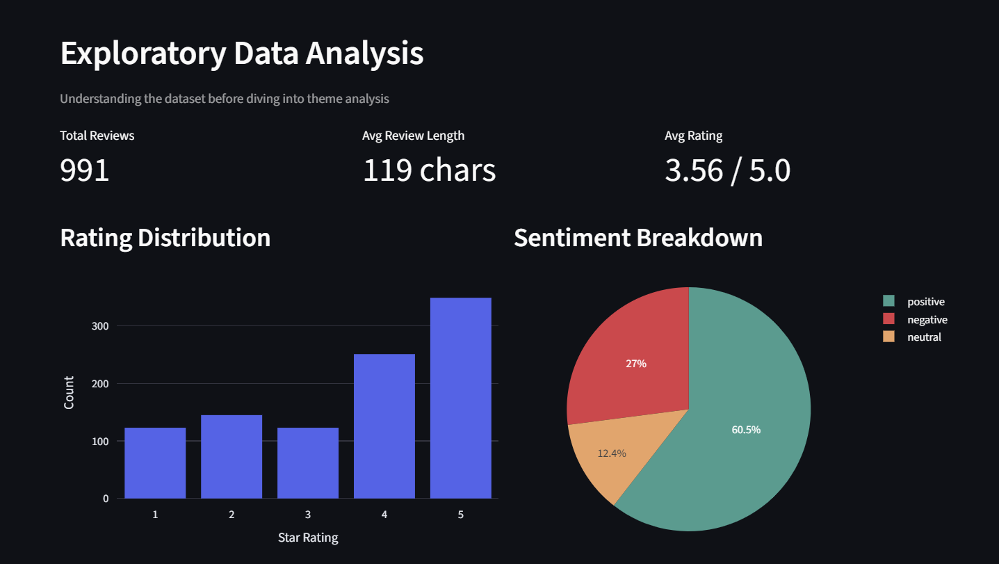

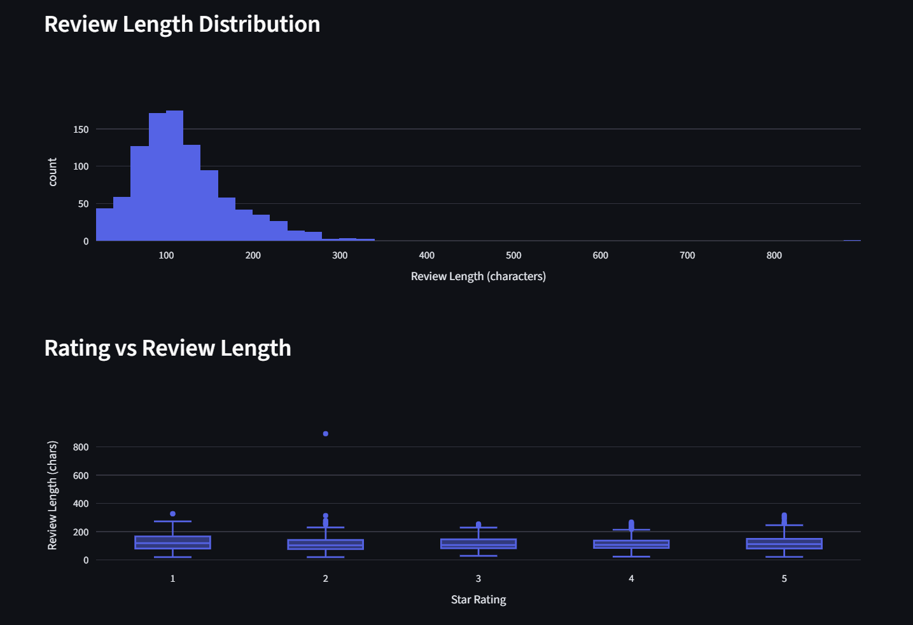

**Feature engineering:**

- `review_length`: character count of each review
- `word_count`: token count of each review
- 9 binary theme columns (`theme_wait_time`, `theme_billing`, etc.) via cosine similarity thresholding
- 9 continuous severity columns storing raw cosine similarity scores
- `overall_sentiment`: derived from star rating (1–2 → negative, 3 → neutral, 4–5 → positive)

**Limitations of data:**

- No date column — trend analysis over time is not possible
- No hospital name column — cross-hospital comparison not available
- Single-source dataset — may not generalize to other regions or hospital types
- All text is English — no multi-language support

---

## 6️⃣ Modeling & AI Strategy

### Model 1: Theme Extraction — Sentence Embeddings + Cosine Similarity

**Model used:** `all-MiniLM-L6-v2` (22M parameters, ~80MB, runs on CPU)

**Why chosen:** Lightweight, deterministic, pre-trained on 1B+ sentence pairs. Handles paraphrasing naturally without keyword engineering. Same input always produces the same output, unlike LLM-based extraction.

**How the model works:**
1. Define 9 operational themes as short phrases (semantic anchors), e.g., `"long waiting time and delays"` for Wait Time
2. Encode all theme descriptions and all 991 reviews into the same 384-dimensional embedding space
3. Compute cosine similarity matrix of shape (991 × 9)
4. If similarity > 0.3, assign that theme. A review can match multiple themes simultaneously

**Alternatives considered:**

| Alternative | Why Rejected |
|---|---|
| Keyword matching | Fragile, misses paraphrases, requires maintaining large word lists |
| BERTopic / LDA | Unsupervised — themes are unnamed and may not align with operational categories |
| Zero-shot classification | Slower, requires larger models |
| LLM-based extraction | Non-deterministic, expensive, overkill for classification |

**Hyperparameter:** Similarity threshold = 0.3, chosen by examining the similarity distribution plot — at 0.3 we get good separation between relevant and irrelevant reviews.

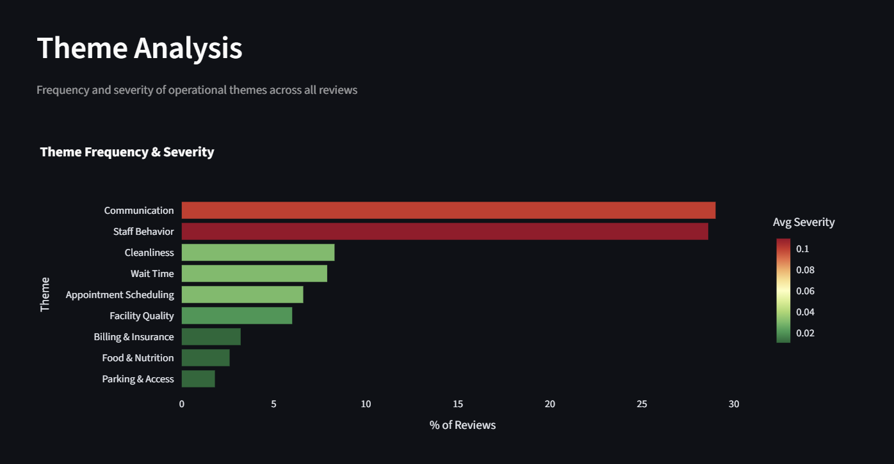

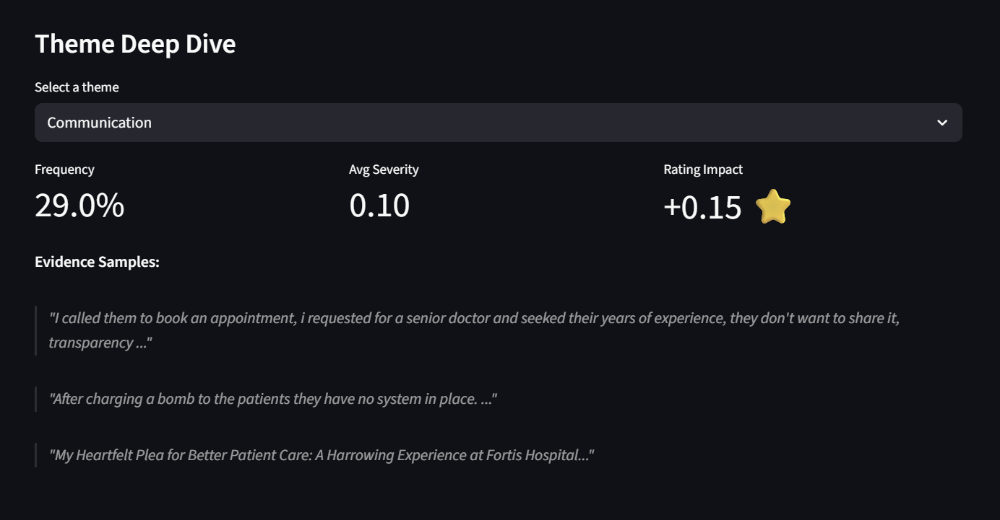

### Model 2: Impact Quantification — Ridge Regression

**Model used:** `Ridge(alpha=1.0)` with `StandardScaler` normalization

**Why chosen:** Coefficients are directly interpretable as "how much this theme shifts the rating." A hospital manager understands "-0.2 stars" — they don't understand "feature importance = 0.15."

**How the model works:**
- Features: 9 binary theme columns (detected / not detected)
- Target: star rating (1–5)
- Output: per-theme coefficient, e.g., `-0.208` for Wait Time = 0.2-star rating drop
- 5-fold cross-validation for R² score
- 100 rounds of bootstrap resampling for confidence intervals. Confidence = proportion of bootstrap samples where coefficient sign matches the main estimate

**Alternatives considered:**

| Alternative | Why Rejected |
|---|---|
| Random Forest | Importance ranking but not interpretable coefficients |
| SHAP values | Expensive; Ridge coefficients already give directional impact |
| Pearson correlation | Too simplistic — doesn't control for confounding themes |

**Hyperparameter:** `alpha=1.0` (L2 regularization strength); 100 bootstrap iterations with `RandomState(42)` for reproducibility.

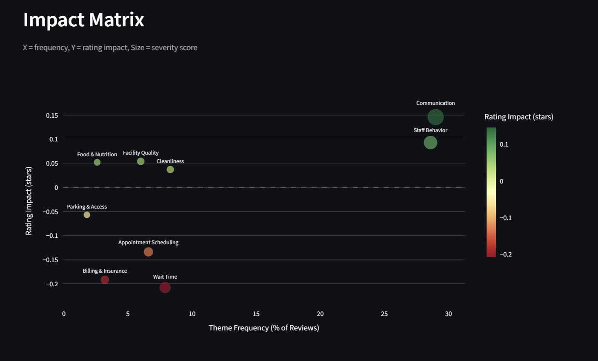

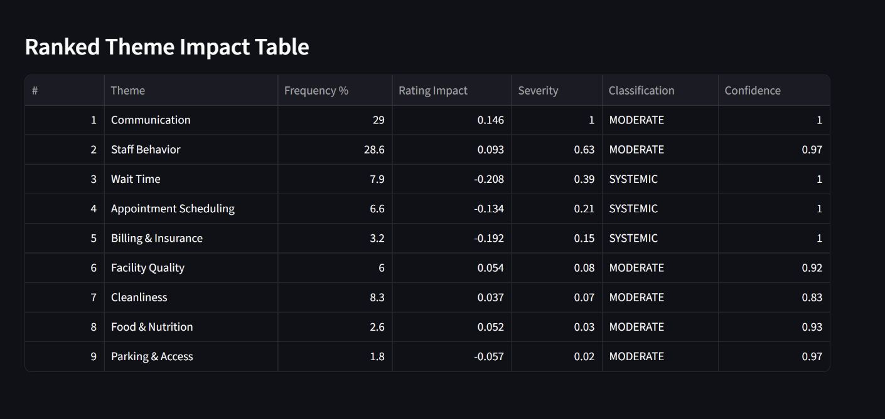

### Model 3: Systemic Detection — Variance-Based Composite Scoring

**How the model works:**
- Compute coefficient of variation (CV = std/mean) of cosine similarity scores among reviews where each theme was detected
- Consistency = `1 - CV`. Low CV = uniform detection strength = systemic pattern
- Composite score = 0.4 × consistency + 0.3 × normalized frequency + 0.3 × normalized absolute impact
- Classification: SYSTEMIC (score ≥ 0.5 AND negative impact) | ISOLATED (score < 0.25) | MODERATE (everything else)

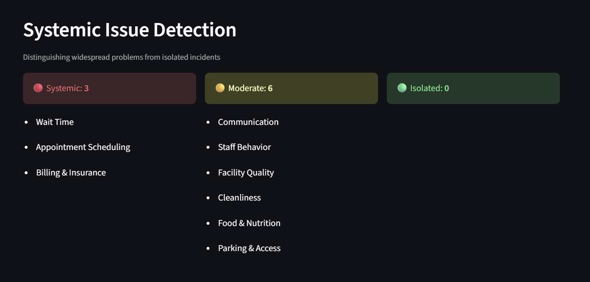

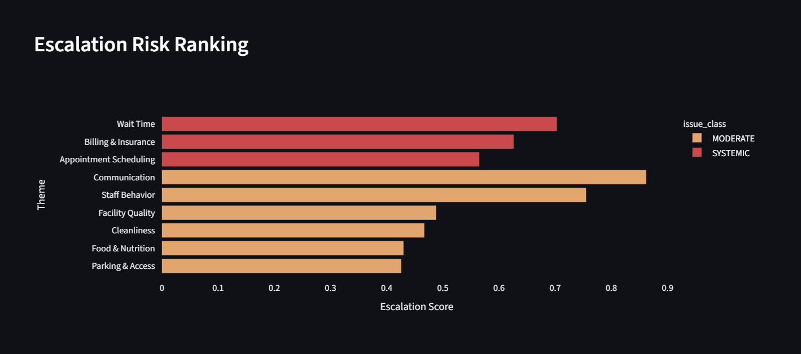

### Model 4: Roadmap Generation — Groq LLM

**Model used:** `llama-3.1-8b-instant` via Groq API

**Prompt structure:** The LLM receives a system prompt to act as a healthcare operations consultant, plus hospital summary stats (total reviews, avg rating, negative rate) and the top 5 themes as a JSON array with frequency, rating impact, and severity. It returns 5–7 prioritized recommendations as a structured JSON array with priority, recommendation text, expected rating lift, and confidence. Temperature = 0.3 for consistency.

**Grounding method:** The LLM never sees raw reviews — it operates only on validated quantitative output. Every recommendation references a specific theme with measured impact. The system works fully without the LLM (returns empty roadmap in demo mode).

**Ranking/scoring mechanism:** Themes are ranked by severity score = `(frequency_pct / 100) × |rating_impact|`, normalized to 0–1. The top 5 by severity are sent to the LLM for roadmap generation.

---

## 7️⃣ Evaluation & Metrics

### Test Cases (8 total, showing 5)

| # | Test Review | Expected Themes | Detected Themes | Result |
|---|---|---|---|---|
| 1 | "I waited over 3 hours past my appointment. The delay was unacceptable." | wait_time, appointment_scheduling | wait_time, appointment_scheduling | Exact match |
| 2 | "The hospital was filthy. Bathrooms were disgusting and rooms smelled bad." | cleanliness | cleanliness, facility | Partial |
| 3 | "Billing department overcharged my insurance and the food was terrible." | billing, food | billing, food | Exact match |
| 4 | "Nurses were rude and dismissive. No one communicated test results." | staff_behavior, communication | staff_behavior, communication | Exact match |
| 5 | "Parking lot was full and I had to walk 10 minutes in the rain." | parking | parking, facility | Partial |

### Evaluation Metrics

| Metric | Score |
|---|---|
| Avg Precision | 0.791 |
| Avg Recall | 0.666 |
| Avg F1 | 0.709 |
| Perfect Match Rate | 50% |

**Why these metrics?**
- **Precision** measures over-detection (false positives) — a hospital manager doesn't want phantom issues flagged
- **Recall** measures under-detection (false negatives) — we don't want to miss real problems
- **F1** balances both — critical because both over- and under-detection have business consequences

**What do these metrics measure?**
Precision tells us what proportion of detected themes are correct. Recall tells us what proportion of expected themes we successfully caught. F1 is their harmonic mean, penalizing models that sacrifice one for the other.

**Limitations:** Test cases are hand-labeled by the team and may reflect our own biases. A larger, independently labeled test set with inter-annotator agreement would be more rigorous.

### Evaluation Visualization

**Similarity Distribution** — 3×3 grid of histograms showing cosine similarity distribution for each theme across 200 sampled reviews, with the 0.3 threshold as a red dashed line.


**Regression Diagnostics** — Ridge coefficients per theme (red = negative impact, green = positive) and bootstrap confidence per theme.


---

## 8️⃣ Business Impact & Actionability

**How this solution helps decision-makers:**

| Question a Manager Asks | ClinsightAI Answer |
|---|---|
| "What are patients complaining about?" | Theme frequency ranking: Communication 29%, Staff Behavior 28.6%, Wait Time 7.9% |
| "Which complaints actually hurt our ratings?" | Rating impact scores: Wait Time -0.208 stars, Billing -0.192 stars |
| "Are these one-off or systemic?" | Issue classification: Wait Time → SYSTEMIC, Staff Behavior → MODERATE |
| "What should we fix first?" | Severity-ranked roadmap with expected rating lift per recommendation |
| "What do 1-star vs 5-star reviews look like?" | Wait Time: 15.7% of 1-star vs 3.5% of 5-star reviews (4.5x gap) |

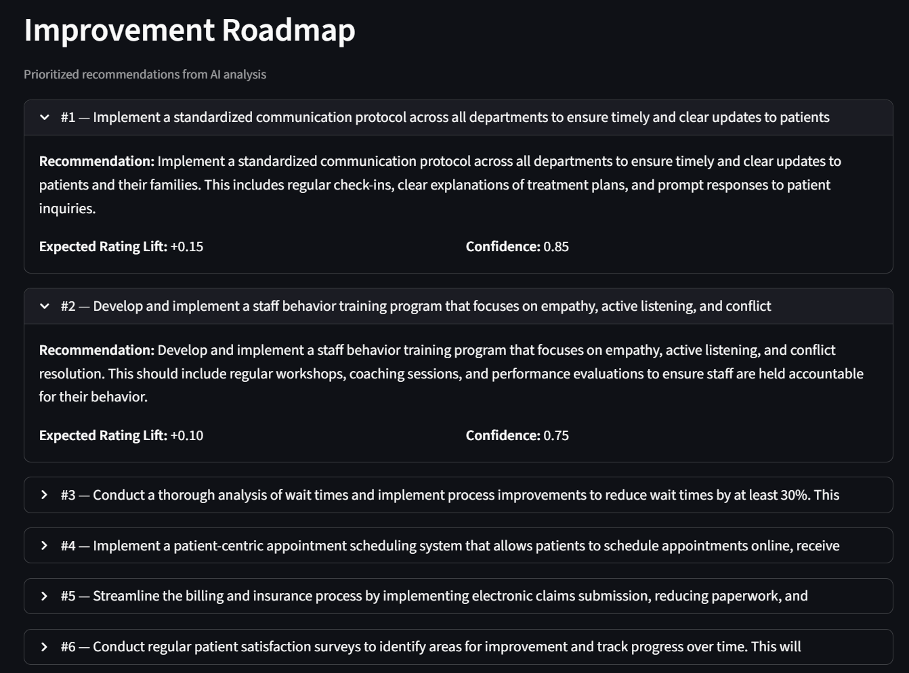

**What actions can be taken from output:**

- Identify the top operational areas hurting ratings and prioritize resource allocation
- Distinguish systemic problems (require structural fixes) from isolated incidents (handle case-by-case)
- Use the prioritized roadmap to plan quarterly improvement initiatives with expected rating lift
- Recognize strengths (Communication, Staff Behavior have positive impact) — don't fix what isn't broken

**Real-world usability:**

- JSON output is directly parseable by hospital BI systems
- Dashboard requires no technical expertise to navigate
- System can be re-run on any new review dataset without retraining

**Limitations:**

- Analysis is correlational, not causal — fixing a theme may not improve ratings by the exact predicted amount
- Recommendations are AI-generated suggestions requiring domain expert validation
- Dataset is a single snapshot — continuous monitoring would require regular re-runs
- No patient demographic data — cannot segment insights by patient group

---

## 9️⃣ Tech Stack

| Category | Details |
|---|---|
| **Language** | Python 3.10+ |
| **Frameworks** | Streamlit (dashboard), scikit-learn (ML) |
| **Libraries** | sentence-transformers, pandas, numpy, matplotlib, plotly, python-dotenv, groq |
| **Databases** | None (file-based CSV input) |
| **Tools** | Groq API (LLaMA 3.1 8B Instant), Conda (environment management) |

---

## 🔟 How to Run the Project

### Clone Repository
```bash
git clone https://github.com/your-repo/ClinsightAI-Clinsight.git
cd ClinsightAI-Clinsight
```

### Install Dependencies
```bash
pip install -r requirements.txt
```

### Run Application
```bash
python main.py
```
This generates `outputs/results.json` and evaluation visualizations.

### Run Dashboard
```bash
streamlit run dashboard/app.py
```

### (Optional) Enable LLM Roadmap
Create a `.env` file in the project root:
```
GROQ_API_KEY=your_groq_api_key_here
```

---

## 1️⃣1️⃣ Repository Structure

```
ClinsightAI/
├── data/
│   └── hospital.csv
├── src/
│   ├── config.py
│   ├── data_loader.py
│   ├── theme_extractor.py
│   ├── impact_quantifier.py
│   ├── systemic_detector.py
│   ├── roadmap_generator.py
│   └── evaluation.py
├── dashboard/
│   └── app.py
├── outputs/
│   ├── results.json
│   ├── similarity_distribution.png
│   └── regression_diagnostics.png
├── docs/
│   └── architecture_diagram.png
├── screenshots/
│   ├── executive_summary.png
│   ├── EDA1.png
│   ├── EDA2.png
│   ├── EDA3.png
│   ├── theme_analysis1.png
│   ├── theme_analysis2.png
│   ├── impact_matrix1.png
│   ├── impact_matrix2.png
│   ├── systemic_issues1.png
│   ├── systemic_issues2.png
│   ├── action_roadmap.png
│   └── raw_data.png
├── main.py
├── requirements.txt
└── README.md
```

---

## 1️⃣2️⃣ Alignment with HackVerse Rubric

**Problem Understanding:** Clear business framing with defined end user (hospital COO), measurable goals, and stated importance of the problem.

**Data & System Design:** 6-step preprocessing pipeline with 99.5% data retention, 7-stage modular architecture with architecture diagram and data flow description, trade-offs documented.

**Technical Depth:** Goes beyond sentiment analysis — embedding-based theme matching, regression impact scoring, variance-based systemic classification with composite scoring, 1-star vs 5-star segmentation.

**Modeling Strategy:** Hybrid approach combining semantic embeddings + Ridge regression + variance analysis + LLM. Each model choice explained with alternatives considered and rejected. Prompt strategy and grounding method documented.

**Evaluation:** 8 test cases covering all 9 themes, precision/recall/F1 metrics with explanations and limitations, 2 evaluation visualizations (similarity distribution + regression diagnostics).

**Business Actionability:** Structured JSON output with prioritized recommendations and expected rating lift. Decision-ready insights table mapping manager questions to system answers. Limitations stated.

**Visualization:** 10-page Streamlit dashboard with interactive charts (Plotly), filterable views, and clean navigation.

**Innovation:** Variance-based systemic detection using coefficient of variation (not a simple frequency threshold), bootstrap confidence intervals for statistical rigor, hybrid retrieval combining embeddings + regression + LLM.

---

## 📜 Compliance Statement

We confirm that this project was developed during HackVerse 2026.
We used only permitted datasets and tools.
No private code sharing occurred between teams.
All work is original.
